# Medicinal Plants Image Classification Using Teachable Machine

## Project Overview
This project presents common medicinal plants in the Philippines such as Lagundi, Sambong, Yerba Buena, Malunggay, Guava, Ginger, and others. It explains their health benefits and simple preparation methods for minor illnesses like cough, fever, wounds, and stomachache.

The aim is to promote awareness of traditional herbal medicine and encourage safe and proper use of natural remedies. These plants do not replace professional medical consultation.

---

# 🌿 Plant Species Gallery

## Lagundi
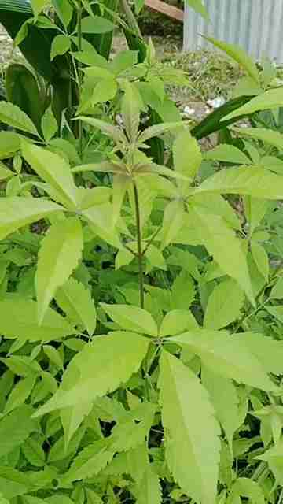  
**Scientific Name:** Vitex negundo  
**Description:** A medium-sized shrub with five-fingered leaves and violet flowers. Commonly used for cough, asthma, and fever.

---

## Sambong
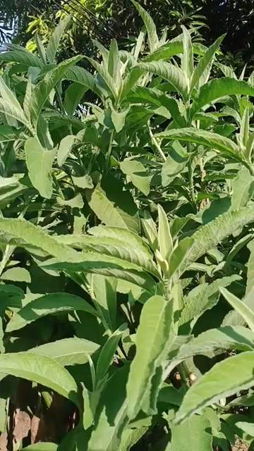  
**Scientific Name:** Blumea balsamifera  
**Description:** A leafy shrub with aromatic, soft leaves. Known for helping with kidney stones and urinary problems.

---

## Yerba Buena
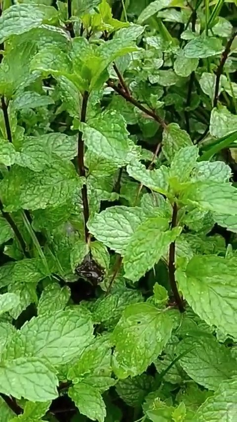  
**Scientific Name:** Clinopodium douglasii  
**Description:** A creeping plant with small mint-like leaves. Used for pain relief and stomachache.

---

## Pansit-pansitan
  
**Scientific Name:** Peperomia pellucida  
**Description:** A small, shiny-leaf plant that grows in damp areas. Often used for arthritis and gout.

---

## Luya (Ginger)
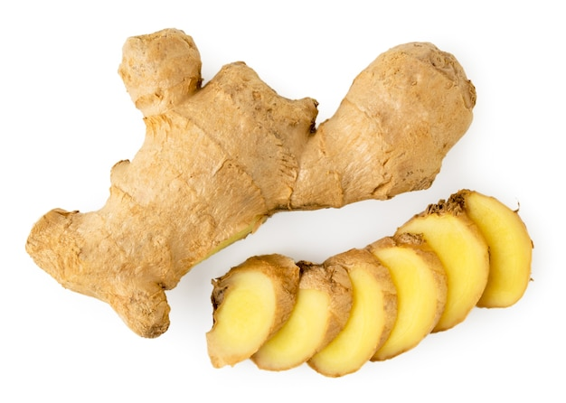  
**Scientific Name:** Zingiber officinale  
**Description:** A root crop with thick underground stems (rhizomes). Used for cough, sore throat, and nausea.

---

## Luyang Dilaw (Turmeric)
  
**Scientific Name:** Curcuma longa  
**Description:** A yellow-orange rhizome plant related to ginger. Known for its anti-inflammatory properties.

---

## Tawa-tawa
  
**Scientific Name:** Euphorbia hirta  
**Description:** A small herb with tiny leaves and hairy stems. Traditionally used for dengue support and asthma.

---

## Oregano
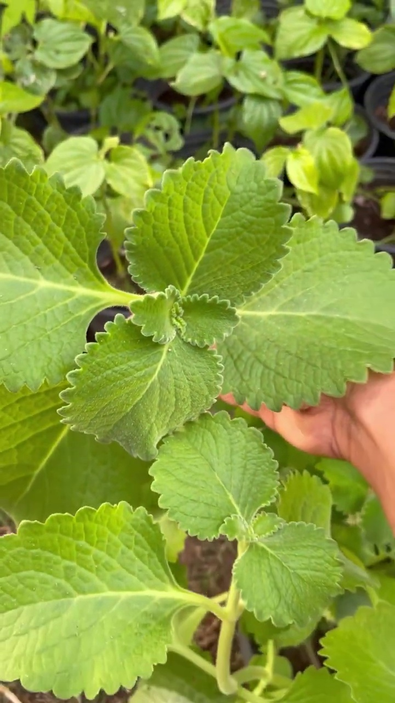  
**Scientific Name:** Plectranthus amboinicus  
**Description:** A thick-leafed aromatic plant. Commonly used for cough and colds.

---

## Balimbing (Star Fruit – Leaves)
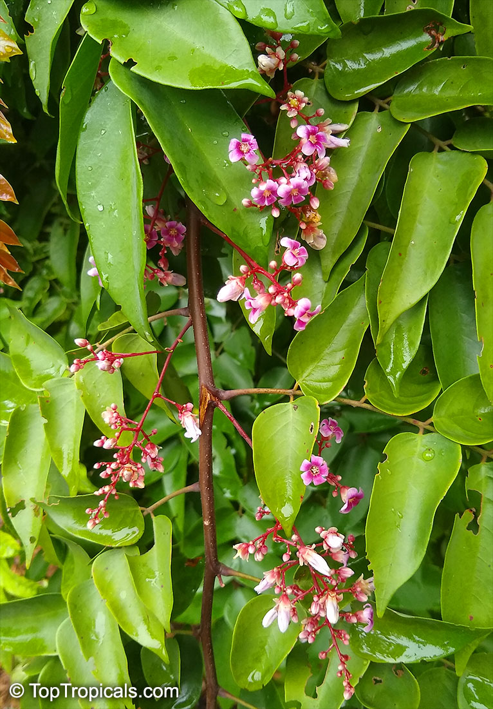  
**Scientific Name:** Averrhoa carambola  
**Description:** A small tree producing star-shaped fruits. Leaves are used for skin and stomach problems.

---

## Tanglad (Lemongrass)
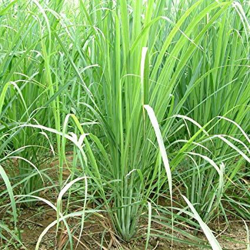  
**Scientific Name:** Cymbopogon citratus  
**Description:** A tall grass with a lemon scent. Used for fever, digestion, and relaxation.

---

## Makabuhay
  
**Scientific Name:** Tinospora crispa  
**Description:** A climbing vine with thick stems. Known for boosting immunity and treating fever.

---

## Guyabano (Leaves)
  
**Scientific Name:** Annona muricata  
**Description:** A small tree with large green leaves and spiky fruits. Leaves are used for relaxation and immune support.

---

## Aloe Vera
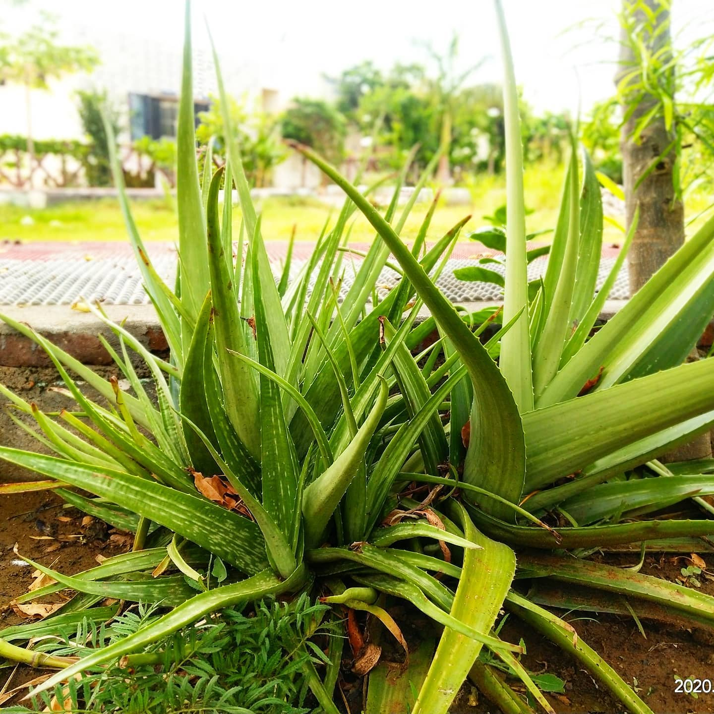  
**Scientific Name:** Aloe barbadensis  
**Description:** A succulent plant with thick, fleshy leaves containing clear gel. Used for burns and skin care.

---

## Ampalaya (Leaves)
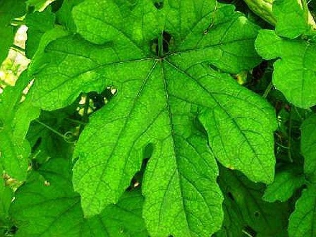  
**Scientific Name:** Momordica charantia  
**Description:** A vine plant with bitter fruit. Leaves are used to help manage blood sugar.

---

## Guava (Leaves)
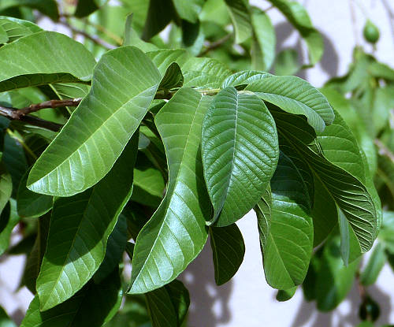  
**Scientific Name:** Psidium guajava  
**Description:** A small tree with oval leaves and round fruits. Leaves are used for wound cleaning and diarrhea.

---

## Pandan
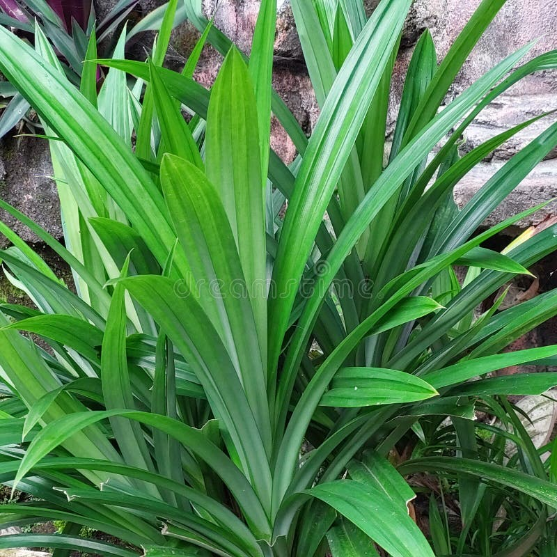  
**Scientific Name:** Pandanus amaryllifolius  
**Description:** A fragrant plant with long, narrow leaves. Used for cooking and mild medicinal purposes.

---

## Malunggay
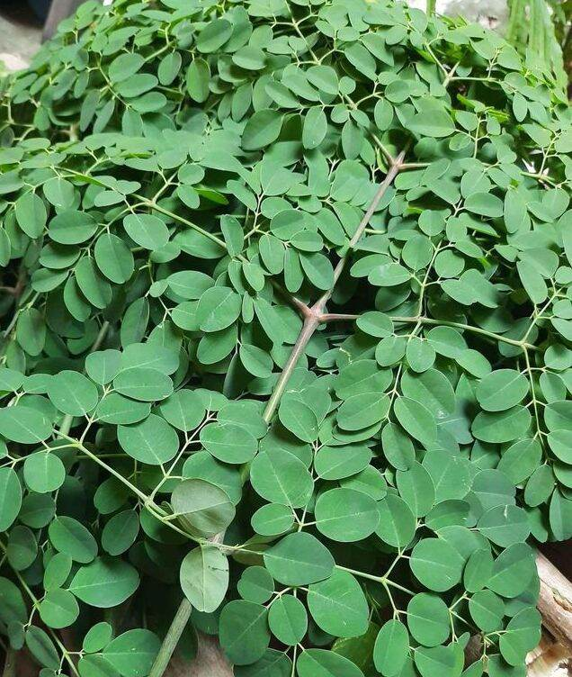  
**Scientific Name:** Moringa oleifera  
**Description:** A fast-growing tree with small round leaves. Rich in vitamins and used to boost nutrition.

---

## Kamias
  
**Scientific Name:** Averrhoa bilimbi  
**Description:** A small tree with sour green fruits. Leaves and fruits are used for cough and skin conditions.

---

## Bawang (Garlic)
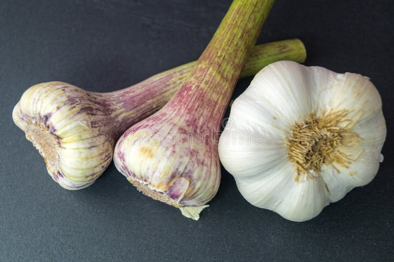  
**Scientific Name:** Allium sativum  
**Description:** A bulb plant with strong-smelling cloves. Known for lowering blood pressure and fighting infections.

---

## Hilbas (Mugwort)
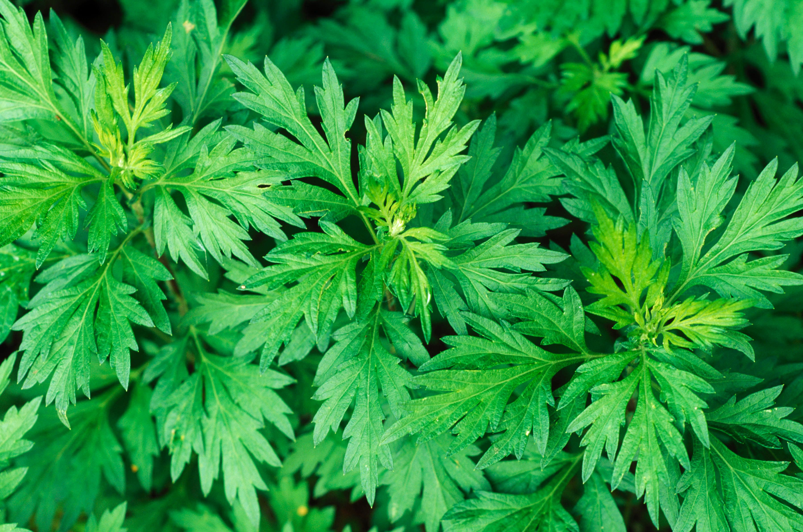  
**Scientific Name:** Artemisia vulgaris  
**Description:** A fast-growing perennial herb with deeply lobed green leaves (silvery underneath). Aromatic and commonly found in fields and roadsides.

---

# 🤖 Model Training Details

- **Epochs:** 100  
- **Batch Size:** 16  
- **Learning Rate:** 0.001  
- **Number of Images per Class:** Minimum 250  

---

# 📊 Model Evaluation

## Confusion Matrix

## Accuracy per Class

## Overall Model Accuracy

---

# 🧪 Model Testing Results

